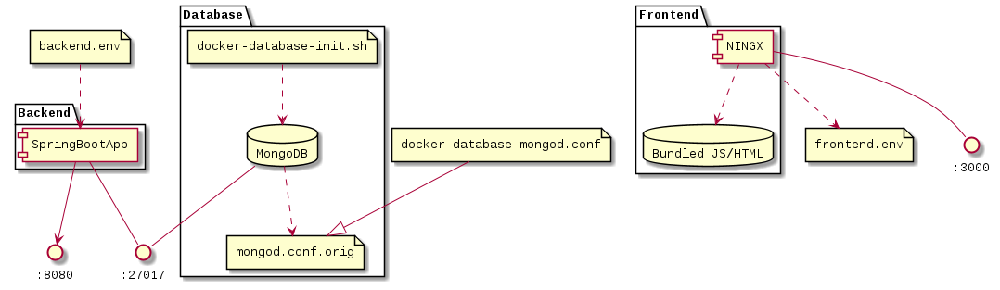

VideoQuotes is all about sharing video scenes and quotes from Youtube channels; this lets people share their favourite video quotes from TV interviews and shows.

# Inspiration

Interesting sites like [BrainyQuote](http://www.brainyquote.com), [grabyo](http://about.grabyo.com), [QuoteFancy](https://quotefancy.com), [Movictopus](https://facebook.com/Mvctopus), [HaikQuotes](https://facebook.com/HaikQuotes) and even the [The Economist](https://www.economist.com) sometimes; that are citing from real and even fictional characters, coming from different different eras and that's where I thought of adding audio/video

------------------------

# Outline

+ [Overview](#Overview)
+ [Configure](#Configure)
+ [Run on Docker/Compose](#Run)
+ [Deployment](#Deployment)
+ [CI/CD & Actions](#Deployment)

## Overview

[](readme/readme.puml)

+ The backend is currently implemented in Spring Boot
+ The frontend is currently implemented in Vue


## Configure

All configurations are extracted from environment variables (or configmaps)
You'll need to change properties in the following files:

+ [backend.env](backend-template.env)
+ [frontend.env](client/frontend-template.env)

## Run on Docker/Compose:

Docker (and docker-compose) is being used for development and production, in both of the backend and frontend.

+ In development environment, the frontend image **watches over file change** and rebuilds the JavaScript bundle file then refreshs the browser page.
In the backend, it uses a monostage docker image and caches the maven `.m2` direcotry (still needs a restart on file change)

+ In production, **multi-stage** images are build, no watching over file-change and only the nessascry parts are being used; for example, in the 2nd stage docker container, there'll be no NPM/NodeJS but just the **bundled JS/Assets** files hosted on NGINX

+ To run the **development** environment:
`docker-compose up database dev-backend dev-frontend`

+ To run the **production** environment:
`docker-compose up database dev-backend dev-frontend`

# Deployment

Currently I'm pushing the docker image to Heroku, see [docs](https://devcenter.heroku.com/articles/container-registry-and-runtime#pushing-an-existing-image) and then it must be marked for ["release"](https://devcenter.heroku.com/articles/container-registry-and-runtime#releasing-an-image), either thru the commandline or API.

```bash
IMAGE="videoquotes_backend"; #TODO
APP="videoquotes"; #TODO
PROCESS_TYPE="web";
docker tag $IMAGE registry.heroku.com/$APP/$PROCESS_TYPE
docker push registry.heroku.com/$APP/$PROCESS_TYPE
```

# CI/CD & Actions

For now, I have 2 actions, one for building and pushing the backend image to Heroku, the other is to build the frontend.

## Backend

### Security

[deploy/heroku.sh](https://github.com/yoga1290/VideoQuotes/blob/master/ci/deploy/heroku.sh) generates Public/Private keys for the OAuth2/JWT  (check [experiment-spring-oauth2-jwt](https://github.com/yoga1290/experiment-spring-oauth2-jwt) for more details)

**TODO: will add more details later on**
